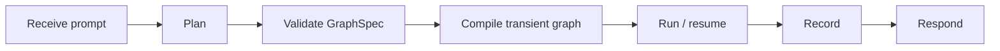

# Dynamic Graphs / Dynamic Subgraphs — Canonical Design v1

**Status:** canonical v1 design brief  
**Supersedes:** `dynamic-graphs-design.md`, `dynamic-graphs-design-claude.md` as implementation guidance  
**Still useful as source drafts:** both earlier notes remain valuable for lineage and discarded alternatives

---

## 1. Thesis

This project is about giving an LLM the ability to synthesize a **temporary, bounded workflow graph** for the problem in front of it:

```text
prompt
  -> graph plan
  -> validated GraphSpec
  -> transient executable graph
  -> execution
  -> recorded trace + output
  -> discard runtime object
```

The important shift is:

- a normal agent chooses **actions** inside a fixed orchestration shape;
- a dynamic-graph agent chooses both **actions and, when warranted, the shape of the computation**.

The right long-term framing is not:

> let the LLM generate arbitrary graphs because it can.

It is:

> let the LLM synthesize bounded, inspectable, replayable programs over a capability vocabulary we control.

The graph is the temporary executable form.  
The **registry** is the language.  
The **recorded runs** are the beginning of memory.

---

## 2. What QuestForge teaches us

QuestForge is a useful neighboring system:

- one director agent;
- several predefined specialist subagents;
- a small tool surface;
- dynamic decisions inside a stable orchestration loop.

It is already a strong example of:

- role separation;
- subagent delegation;
- tool-gated output;
- a legible orchestration boundary.

But QuestForge does **not** let the model invent:

- new topology;
- new node sets;
- a fresh graph per problem.

So QuestForge is best understood as:

> fixed orchestration, dynamic choice.

Dynamic subgraphs add:

> dynamic topology, under bounded semantics.

That distinction matters. We should keep the virtues of QuestForge — named roles, constrained tools, explicit gates — while exploring a more flexible execution layer.

---

## 3. The four meanings of “dynamic”

These are related, but not interchangeable:

| Dimension | Meaning | Example |
|---|---|---|
| **Dynamic parameters** | same node, different values | call the same search tool with a new query |
| **Dynamic fan-out** | same shape, variable width | search 3 sources now, 20 sources later |
| **Dynamic routing** | choose among known paths at runtime | if confidence is low, gather more evidence |
| **Dynamic topology** | create new nodes and edges at runtime | invent a bespoke 5-node workflow for this task |

Most practical systems can go far with the first three.  
The research frontier in this project is the fourth.

That should keep us honest:

- do not pay topology-synthesis cost when routing is enough;
- do not confuse “parallel” with “new graph”;
- make novelty earn its keep.

---

## 4. What LangGraph gives us

LangGraph is sufficient for the first serious version of this idea:

1. `StateGraph.compile()` returns a runnable object; it does not have to be treated as a once-per-program build step.
2. A compiled subgraph can be passed into a parent graph when state schemas are shared, or invoked inside a wrapper node when the parent and child schemas differ.
3. `Send` gives runtime fan-out when the number of workers is not known ahead of time.
4. `Command` allows a node to update state and route execution in one return value.
5. `interrupt()` with checkpointing gives durable pause/resume semantics for human input, external callbacks, or long waits.
6. The Functional API is a useful alternative when explicit graph topology is ceremony rather than leverage.

So the narrow technical answer is:

> yes, runtime graph construction is possible.

The architectural question is:

> when is a novel transient graph better than a static graph with dynamic routing?

---

## 5. Architectural options

### A. Static host graph with dynamic routing

```text
planner -> worker -> reducer -> maybe_continue -> done
```

The model controls:

- work items;
- widths of parallel fan-out;
- routing decisions.

The topology remains stable.

**Best for:**

- robust production flows;
- tool-use loops;
- map/reduce work;
- cases where the shape is broadly known.

**Strengths:**

- simplest to test;
- cheapest to run;
- easiest to observe;
- checkpointing and tracing stay straightforward.

**Limit:**

- if the task really wants a novel multi-stage pipeline, the host graph must already know how to express it.

### B. Literal dynamic graph generation

The planner emits literal `nodes[]` and `edges[]`.
The runtime validates, compiles, executes, records, and discards the graph.

**Best for:**

- heterogeneous tasks;
- learning what workflow motifs emerge;
- research into graph synthesis itself.

**Strengths:**

- most expressive;
- naturally replayable;
- naturally visualizable.

**Limits:**

- strongest need for validation;
- highest debugging burden;
- easiest path to cost blowups if unconstrained.

### C. Hybrid supervisor + transient subgraph

This is the recommended v1 architecture.



The outer graph is small and durable.  
The inner graph is temporary and problem-shaped.

**Why this should be v1:**

- it isolates the experimental part;
- it keeps the supervisor legible;
- it lets us record real emitted topologies;
- it preserves an easy migration path:
  - recurring shapes can later become static routes or named templates;
  - starting hybrid does not trap us in “dynamic everywhere.”

---

## 6. Canonical v1 recommendation

Build:

```text
static supervisor graph
  + bounded node registry
  + versioned GraphSpec
  + validator
  + transient graph compiler
  + recorder / replay layer
```

More concretely:

1. Keep one always-present supervisor graph:
   - `receive_prompt`
   - `plan`
   - `validate`
   - `compile_and_run`
   - `record`
   - `respond`
2. Let the planner emit **plans**, not executable code.
3. Let the compiler instantiate only registry-approved node kinds.
4. Persist every plan and every run.
5. Discard compiled transient graphs after completion unless they are paused or intentionally retained for replay/resume.

---

## 7. The node-kind registry is the language

The most important design object in the whole system is not the graph compiler.
It is the **registry of allowed node kinds**.

This registry is the boundary between:

- what the model can imagine;
- what the runtime can safely do.

### Candidate v1 registry

| Kind | Purpose | Notes |
|---|---|---|
| `llm_call` | ask a model to transform or reason | general reasoning primitive |
| `tool_call` | invoke an allowlisted tool | normal action seam |
| `spawn_subagent` | invoke a named specialist agent | QuestForge-like delegation |
| `parallel_map` | fan one operation over many inputs | likely implemented with `Send` |
| `reduce` | merge prior outputs | deterministic or LLM-backed |
| `branch` | choose among named exits | no arbitrary executable condition |
| `wait_for_event` | suspend until durable external input | checkpoint / resume primitive |
| `emit_artifact` | write a file / message / report | explicit side-effect boundary |

### Explicitly not v1

- `python_eval`
- arbitrary shell
- arbitrary network access
- “call any installed tool by name”
- runtime mutation of the registry

Those are not forbidden forever.
They are withheld until the safety, tracing, and sandbox story deserves them.

---

## 8. GraphSpec v1

The planner should emit a versioned JSON-compatible object.

```json
{
  "schema_version": 1,
  "graph_id": "uuid-or-content-hash",
  "goal": "compare candidate libraries for a use case",
  "rationale": "parallel evidence gathering followed by critique and reconciliation",
  "budget": {
    "max_nodes": 12,
    "max_depth": 2,
    "max_wall_seconds": 90,
    "max_llm_calls": 8
  },
  "nodes": [
    {
      "id": "gather",
      "kind": "parallel_map",
      "inputs": ["queries"],
      "outputs": ["sources"],
      "params": {
        "over": "queries",
        "child_kind": "tool_call",
        "child_params": {"tool_name": "web_search"}
      }
    },
    {
      "id": "compare",
      "kind": "llm_call",
      "inputs": ["sources"],
      "outputs": ["draft"],
      "params": {
        "instruction": "compare the evidence"
      }
    }
  ],
  "edges": [
    {"from": "START", "to": "gather"},
    {"from": "gather", "to": "compare"},
    {"from": "compare", "to": "END"}
  ],
  "metadata": {
    "planner_model": "…",
    "purpose": "research",
    "created_at": "…"
  }
}
```

### Why `rationale` belongs in the spec

It is not executed, but it helps:

- humans understand why a shape was chosen;
- evals compare chosen topology against intent;
- future retrieval can search both structural and semantic similarity.

---

## 9. Validation contract

Before compile, reject specs that fail any of the following:

- unsupported `schema_version`;
- duplicate node ids;
- unknown node kinds;
- params that fail that node kind’s schema;
- dangling edges;
- no path from `START` to `END`;
- unreachable nodes;
- undeclared or unbounded cycles;
- exceeded node / depth / time / LLM budgets;
- missing required upstream inputs;
- illegal side effects for the current run mode;
- nested graph depth beyond limit;
- references to unavailable tools or subagents.

After execution, verify and record:

- every declared output is present or has a structured error;
- every node has timing and status;
- every side effect is attributed;
- total cost and latency are rolled up;
- parent/child lineage is preserved for nested runs;
- resume events are captured when interruptions occur.

The validator is the line between:

> an LLM proposed a graph

and:

> the system accepted a program.

---

## 10. State model for v1

Do **not** generate a custom `TypedDict` for every transient graph yet.

Use one generic runtime envelope:

```python
class DynamicRunState(TypedDict):
    inputs: dict[str, Any]
    values: dict[str, Any]
    artifacts: dict[str, Any]
    errors: list[dict[str, Any]]
    events: list[dict[str, Any]]
    metadata: dict[str, Any]
```

Why:

- easier to ship;
- easier to inspect;
- easier to replay;
- avoids premature graph-specific schema codegen.

Later, when recurring families become stable, promote them to stricter typed state models.

---

## 11. Async is three different things

### A. Short concurrent work

Examples:

- query 5 sources;
- run 3 calculations;
- summarize several documents.

Use:

- normal async execution;
- `Send`-style fan-out;
- no durable suspension required.

### B. Durable waiting

Examples:

- wait for a human answer;
- wait for a webhook;
- resume after a rate limit;
- pause until an external condition is met.

Use:

- `wait_for_event`;
- checkpointing;
- `interrupt()` / resume semantics;
- stable run ids.

### C. Detached background work

Examples:

- launch a long analysis job;
- continue elsewhere;
- join the result later.

This requires more than a graph.

You need a **job manager**:

- job id;
- queue / worker;
- durable status store;
- timeout / cancellation;
- callback or polling path.

The graph is the **control plane**.  
The worker system is the **execution plane**.

That distinction should stay explicit in the design.

---

## 12. Recording, replay, and the path to memory

Recording is mandatory.

Each run should preserve:

- original prompt;
- planner rationale;
- normalized `GraphSpec`;
- rendered Mermaid diagram;
- per-node inputs / outputs / errors;
- timings;
- token and cost accounting;
- emitted artifacts;
- final output;
- model and tool versions;
- parent-child lineage;
- pause / resume events.

### Minimal file layout

```text
runs/
  <run_id>/
    prompt.md
    spec.json
    graph.mmd
    trace.jsonl
    output.json
    summary.md
```

Once this exists, we gain:

- replay;
- diffing;
- evals;
- failure analysis;
- graph-shape clustering;
- retrieval over prior successful workflows.

That is how the project can evolve from:

> ad hoc graph invention

to:

> accumulating an internal library of useful cognitive organizations.

---

## 13. Debuggability and observability

Synthesized graphs have one especially dangerous failure mode:

> runtime errors may look like they came from the generic `compile_and_run` wrapper instead of from the conceptual node the planner created.

Mitigate this from the first implementation:

- every node wrapper receives the stable planner node id;
- every node logs start / finish / status / duration;
- every exception is caught, normalized, and attached to the node id;
- traces preserve input / output snapshots;
- rendered diagrams use the same ids as traces;
- the recorder writes failed runs too.

The system should make it easy to answer:

- what graph did the planner think it made?
- what graph did the compiler actually run?
- which node failed?
- with what input?
- after which prior outputs?

---

## 14. Failure modes and guardrails

### Cost explosion

Guardrails:

- explicit budgets in `GraphSpec`;
- planner-visible cost pressure;
- global per-run caps;
- record failed over-budget plans.

### Infinite recursion

Guardrails:

- nested graph depth counter;
- parent budget inheritance;
- no unbounded dynamic-subgraph spawning in v1.

### “Everything becomes an LLM call”

Guardrails:

- strong deterministic primitives;
- explicit cost accounting;
- planner feedback about cheaper options;
- evals that score cost as well as success.

### Registry bloat

Guardrails:

- smallest useful registry first;
- promote new node kinds only after repeated evidence;
- deprecate dead kinds;
- keep params typed and documented.

### Orphaned async jobs

Guardrails:

- job handles;
- explicit join semantics;
- durable status;
- cancellation and timeout policies.

---

## 15. Maturity curve

### Phase 1 — transient graph experiments

- hardcoded specs first;
- then LLM-generated specs;
- all runs recorded;
- little or no reuse.

Goal:

- prove runtime graph synthesis is useful.

### Phase 2 — motif emergence

- cluster recurring shapes;
- compare cost / latency / success;
- begin naming repeated forms.

Goal:

- learn the system’s natural grammar.

### Phase 3 — reusable graph library

- recurring motifs become templates;
- planner can reference prior templates by id;
- recorded successful graphs become retrievable building blocks.

Goal:

- move from improvisation to composition.

### Phase 4 — adaptive orchestration

The system chooses among:

- fixed routes;
- named templates;
- genuinely novel transient graphs.

Goal:

- novelty only when novelty is worth it.

---

## 16. One-week implementation path

### Day 1 — prove runtime compilation

- hardcoded `GraphSpec`;
- compile it during runtime;
- execute it;
- persist `spec.json` and `output.json`.

### Day 2 — make the artifact visible

- add recorder;
- render Mermaid;
- persist per-node trace;
- replay the same spec.

### Day 3 — add the planner

- structured LLM output;
- schema validation;
- reject malformed plans cleanly.

### Day 4 — add meaningful dynamism

- `parallel_map`;
- `branch`;
- `reduce`;
- `spawn_subagent`.

### Day 5 — add durable waiting

- `wait_for_event`;
- interrupt / resume;
- persisted run ids.

### Day 6 — add evals

- 5–10 hand-authored prompts;
- expected rough graph shapes;
- success / cost / latency comparisons.

### Day 7 — repair the first real weakness

Probably one of:

- planner spec quality;
- validator ergonomics;
- registry insufficiency;
- trace readability.

---

## 17. First demo worth building

Prompt:

> Investigate whether tool A or tool B is better for my use case, gather evidence in parallel, ask a specialist subagent to challenge the initial conclusion, then summarize the answer.

Expected graph:

```text
START
 ├─ gather_a
 ├─ gather_b
 └─ gather_constraints
      ↓
 initial_compare
      ↓
 spawn_critic_subagent
      ↓
 reconcile
      ↓
 END
```

Why this demo is good:

- it needs fan-out;
- it uses a subagent;
- it uses reduction;
- the graph shape is intelligible;
- the structure materially improves the work.

---

## 18. Repository organization for an agent-legible project

The repo should be designed so an agent can orient itself quickly without inhaling a giant instruction blob.

The right pattern is:

- small entrypoints;
- docs as system of record;
- progressive disclosure;
- plans and architectural beliefs kept in-repo;
- mechanical enforcement where possible.

### Proposed repo shape

```text
Dynamic Subgraphs/
├── AGENTS.md
├── ARCHITECTURE.md
├── README.md
├── app/
│   ├── supervisor/
│   ├── compiler/
│   ├── registry/
│   ├── runtime/
│   ├── recording/
│   └── models/
├── docs/
│   ├── index.md
│   ├── design-docs/
│   │   ├── index.md
│   │   ├── canonical-design-v1.md
│   │   ├── graphspec-v1.md
│   │   ├── registry-policy.md
│   │   └── async-semantics.md
│   ├── exec-plans/
│   │   ├── active/
│   │   ├── completed/
│   │   └── tech-debt-tracker.md
│   ├── references/
│   │   ├── langgraph-notes.md
│   │   └── prior-art.md
│   ├── generated/
│   │   └── registry-schema.md
│   ├── RELIABILITY.md
│   ├── SECURITY.md
│   └── QUALITY_SCORE.md
├── runs/
├── tests/
└── scripts/
```

### Role of each top-level doc

| File | Purpose |
|---|---|
| `AGENTS.md` | short map of where to look; never the encyclopedia |
| `ARCHITECTURE.md` | package boundaries and dependency direction |
| `docs/index.md` | docs table of contents |
| `docs/design-docs/canonical-design-v1.md` | current source of truth |
| `docs/exec-plans/active/` | live implementation plans |
| `docs/references/` | external references and distilled notes |
| `docs/generated/` | machine-produced docs that should be refreshable |
| `docs/QUALITY_SCORE.md` | honest grading of system maturity |
| `docs/RELIABILITY.md` | failure handling, replay, resume, SLOs |
| `docs/SECURITY.md` | registry policy, side effects, sandbox boundaries |

### Design principle

`AGENTS.md` should be a **map**, not a manual.

An agent should be able to:

1. open `AGENTS.md`;
2. learn what the repo is;
3. learn which 3–5 docs matter for its task;
4. descend only as needed.

That keeps the project teachable as it grows.

---

## 19. Decision log

### Chosen for v1

- hybrid supervisor + transient subgraph;
- versioned `GraphSpec`;
- planner rationale stored with spec;
- generic `DynamicRunState`;
- bounded typed registry;
- full recording from day one;
- no arbitrary code execution in v1;
- docs-first repo organization.

### Deferred

- nested dynamic graphs beyond shallow controlled depth;
- arbitrary Python execution;
- automatic promotion of motifs into templates;
- per-graph custom state classes;
- distributed workers beyond one explicit background-job integration.

---

## 20. Open questions

1. Is the unit of work one transient graph per user prompt, or can one conversation mint several graphs over time?
2. Should dynamic graphs be allowed to spawn dynamic graphs in phase one, or only after basic replay and budgeting are strong?
3. Which first domain truly benefits from topology synthesis:
   - research,
   - code analysis,
   - long-running automations,
   - multi-agent creative work,
   - something else?
4. Do successful runs become:
   - exact replay artifacts,
   - reusable templates,
   - or abstract motifs retrieved by similarity?
5. How much of the planner’s rationale should be exposed to users versus kept as internal run metadata?

---

## 21. Final design stance

Dynamic graphs are worth pursuing.

But the project should not become a shrine to novelty.
The mature version is not an agent that invents a brand-new graph for every prompt.
It is a system that:

- uses fixed routes when fixed routes suffice;
- reaches for templates when precedent exists;
- synthesizes new graphs only when the problem genuinely asks for a new shape;
- records every meaningful attempt so its future self begins with more structure than its past self had.

That is the larger ambition:

> **a system that learns how to assemble temporary organizations of cognition.**

---

## References

- OpenAI, **Harness engineering: leveraging Codex in an agent-first world**  
  `https://openai.com/index/harness-engineering/`
- LangGraph Graph API overview  
  `https://docs.langchain.com/oss/python/langgraph/graph-api`
- LangGraph subgraphs guide  
  `https://docs.langchain.com/oss/python/langgraph/use-subgraphs`
- LangGraph interrupts guide  
  `https://docs.langchain.com/oss/python/langgraph/interrupts`
- LangGraph Functional API overview  
  `https://docs.langchain.com/oss/python/langgraph/functional-api`
- `StateGraph.compile()` reference  
  `https://reference.langchain.com/python/langgraph/graph/state/StateGraph/compile`
