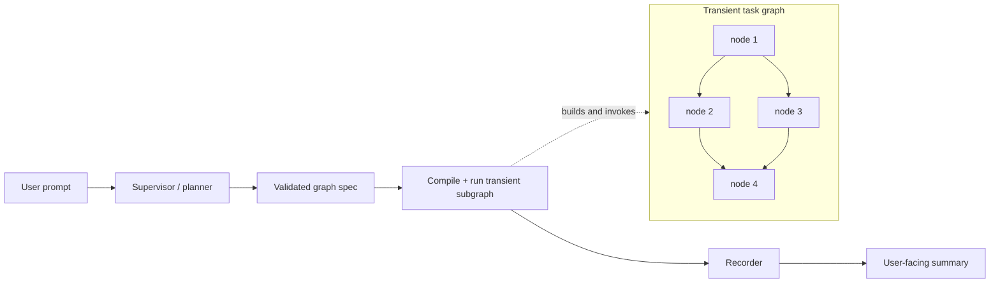

# Dynamic Graphs / Dynamic Subgraphs — Design Notes

## Short answer

Yes: the idea is real, and it is more interesting than a normal “agent with tools.”

The important distinction is this:

- a normal agent chooses **actions** inside a fixed execution shape;
- a dynamic-graph agent chooses both **actions and the shape of the computation** it wants to run.

That means the model is no longer only deciding *what to do next*.
It is synthesizing a small, temporary program:

```text
prompt
  -> graph plan
  -> validated graph spec
  -> compiled transient graph
  -> execution
  -> recorded trace + output
  -> discard runtime object
```

My strongest recommendation is **not** to let the LLM invent arbitrary Python or arbitrary node semantics.
Let it synthesize a graph over a **bounded catalog of typed node kinds**.

That gives you most of the magic while keeping the system inspectable, replayable, and eventually safe enough to trust.

---

## What QuestForge is actually doing today

QuestForge is useful context because it already proves one neighboring idea:

- one orchestrating agent;
- several predefined specialist subagents;
- a small tool surface;
- the director chooses *which specialist to call* and *when*.

That is a **fixed orchestration graph with dynamic decisions inside it**.

The important thing QuestForge is *not* doing:

- it is not letting the model create new node types;
- it is not letting the model emit a new topology;
- it is not compiling a fresh graph per problem.

So QuestForge is a good reference for:

- role separation;
- subagent delegation;
- stateful orchestration;
- tool-gated outputs;
- the value of a small, legible control surface.

But your new idea is a step beyond QuestForge:

> let the LLM decide the topology itself, not merely route through a topology we designed in advance.

That is the genuinely novel part.

---

## The core insight

A dynamic graph is best thought of as a **runtime-generated intermediate representation**.

The LLM should emit something like:

```json
{
  "goal": "compare three candidate libraries and recommend one",
  "nodes": [
    {
      "id": "search_a",
      "kind": "web_search",
      "params": {"query": "library A docs"}
    },
    {
      "id": "search_b",
      "kind": "web_search",
      "params": {"query": "library B docs"}
    },
    {
      "id": "search_c",
      "kind": "web_search",
      "params": {"query": "library C docs"}
    },
    {
      "id": "compare",
      "kind": "llm_reduce",
      "params": {"instruction": "compare evidence and recommend one"}
    }
  ],
  "edges": [
    {"from": "START", "to": "search_a"},
    {"from": "START", "to": "search_b"},
    {"from": "START", "to": "search_c"},
    {"from": "search_a", "to": "compare"},
    {"from": "search_b", "to": "compare"},
    {"from": "search_c", "to": "compare"},
    {"from": "compare", "to": "END"}
  ]
}
```

That spec is the artifact.
The LangGraph object is just the temporary executable form of it.

The node catalog is the language.
The compiler is the boundary.
The recorder is the memory.

If you keep those three pieces cleanly separated, the system can grow without becoming occult.

---

## What LangGraph currently gives you

For a local Python runtime, LangGraph is already flexible enough for the experiment:

1. `StateGraph.compile()` returns a compiled runnable graph object; compilation is not inherently a one-time build step in the Python library.
2. A compiled subgraph can be passed directly into a parent graph when state channels are shared, or invoked inside a wrapper node when the parent and child state schemas differ.
3. `Send` supports runtime fan-out where the exact number of downstream tasks is not known ahead of time.
4. `Command` lets a node combine state updates with routing decisions.
5. `interrupt()` plus checkpointing gives you durable pause/resume for human approval, external events, or long waits.
6. The Functional API offers a more normal-Python way to express workflows when explicit topology is not buying you much.

So the answer to the narrow technical question is:

> yes, you can build, compile, invoke, and discard graphs during runtime.

The better question is:

> when should you do that, instead of using a fixed host graph with dynamic routing?

---

## Four kinds of “dynamic”

These are easy to blur together, but they are different powers:

| Dimension | Meaning | Example |
|---|---|---|
| **Dynamic parameters** | same node, different inputs | call `web_search` with a new query |
| **Dynamic fan-out** | same topology, variable width | search 3 sources today, 20 tomorrow |
| **Dynamic routing** | choose among known edges at runtime | if answer is weak, go gather more evidence |
| **Dynamic topology** | create new nodes/edges at runtime | invent a bespoke 5-node workflow for this problem |

You do not need full dynamic topology to get a lot of power.
Most production systems can go very far with the first three.

The interesting research frontier is the fourth.

---

## Three viable architectures

### 1. Fixed host graph with dynamic routing

```text
planner -> worker -> reducer -> maybe_continue -> done
```

The model chooses:

- which work items exist;
- how many there are;
- where to route next.

But the graph shape is stable.

This is the most robust production design.
It is easy to test, easy to monitor, and still surprisingly expressive.

Use this when:

- you mostly need variable breadth, not novel structure;
- your tasks resemble map/reduce, tool-use loops, or bounded branch logic;
- you care more about reliability than research value.

### 2. Literal dynamic graph generation

The model emits `nodes[]` and `edges[]`.
Your compiler validates the spec, instantiates node wrappers, compiles the graph, executes it, records it, and discards it.

This gives the model the most expressive power.

Use this when:

- the problem shapes are genuinely heterogeneous;
- graph structure itself is part of what you want to study;
- you want to learn what workflow motifs the model invents before you harden anything.

### 3. Hybrid supervisor + transient subgraph

This is the architecture I would actually build first.



The outer graph stays small and stable:

```text
interpret -> plan -> validate -> run_transient_graph -> record -> respond
```

The inner graph is where the model gets to improvise.

This is the sweet spot because:

- the system remains debuggable;
- the dynamic part is isolated;
- you can log the exact emitted topology;
- you can later promote recurring motifs into first-class templates;
- you do not need to bet the whole architecture on graph synthesis before learning whether it pays rent.

---

## My recommendation

Build the hybrid.

More specifically:

1. **Keep one small compiled supervisor graph** that always exists.
2. Give the planner a constrained output schema called something like `GraphSpec`.
3. Make the transient graph compiler pure and boring:
   - validate spec;
   - instantiate node wrappers from a registry;
   - wire edges;
   - compile;
   - invoke;
   - return final state.
4. Persist the spec, trace, rendered diagram, and result for every run.
5. Throw away the compiled transient graph object after execution unless it is needed for a paused/resumable run.

In other words:

> the LLM should author **plans**, not executable code.

---

## The real architecture

```text
┌──────────────────────────────────────────────────────────────┐
│                    Static supervisor graph                   │
│                                                              │
│  receive_prompt                                              │
│      ↓                                                       │
│  planner_llm  ── emits GraphSpec                             │
│      ↓                                                       │
│  spec_validator ── rejects unsafe / malformed plans          │
│      ↓                                                       │
│  graph_compiler ── turns GraphSpec into transient graph       │
│      ↓                                                       │
│  graph_runner ── executes or resumes the transient graph      │
│      ↓                                                       │
│  recorder ── writes spec, trace, metrics, outputs             │
│      ↓                                                       │
│  response_builder                                           │
└──────────────────────────────────────────────────────────────┘
```

And beside it:

```text
┌──────────────────────┐
│  Node-kind registry  │
│----------------------│
│ web_search           │
│ llm_call             │
│ tool_call            │
│ spawn_subagent       │
│ parallel_map         │
│ wait_for_event       │
│ reduce               │
│ branch               │
│ emit_artifact        │
└──────────────────────┘
```

The registry is more important than the graph library.
It is the vocabulary from which the model can compose.

---

## Why the registry matters more than the graph

If the LLM can only choose from safe, typed operators, the system is controllable.

If the LLM can invent arbitrary executable semantics, you are effectively doing open-ended code generation inside your runtime.

That creates three problems at once:

1. **Safety** — the model can ask the runtime to do anything its code can express.
2. **Observability** — node semantics are no longer standardized enough to compare across runs.
3. **Learning** — you cannot tell whether a repeated success came from a useful workflow pattern or merely one clever bespoke blob of generated code.

So I would make node kinds:

- few;
- typed;
- capability-oriented;
- independently testable;
- versioned.

Example first-pass registry:

| Kind | Purpose | Notes |
|---|---|---|
| `llm_call` | ask a model to transform or reason | ordinary textual reasoning |
| `tool_call` | call an allowlisted Python tool | the normal action seam |
| `spawn_subagent` | run a named specialist agent | QuestForge-like delegation |
| `parallel_map` | fan one operation over many inputs | use `Send` under the hood |
| `reduce` | merge prior outputs | usually LLM or deterministic reducer |
| `branch` | choose one of named exits | no arbitrary code |
| `wait_for_event` | suspend until external input arrives | use interrupt/checkpoint semantics |
| `emit_artifact` | write a file / report / message | explicit side-effect boundary |

What I would **not** ship in v1:

- `python_eval`
- arbitrary shell
- arbitrary HTTP to any host
- “call any installed tool by name”
- dynamic mutation of the registry itself

Those are future powers, not starting assumptions.

---

## Dynamic graphs vs dynamic subgraphs

There are two layers worth separating:

### Dynamic subgraph

A known outer process invokes a temporary inner graph to solve one bounded subproblem.

Example:

- main agent receives a research request;
- emits a transient graph for gathering evidence;
- waits for that graph to finish;
- incorporates the result into its ongoing conversation.

This is the easiest thing to ship well.

### Dynamic graph system

The whole runtime is graph-generative:

- one transient graph may spawn another;
- outputs from prior graphs become reusable motifs;
- the system may learn which graph shapes work best for which task families.

That is much more powerful, but it requires:

- depth limits;
- graph lineage;
- budgeting across nested runs;
- stronger replay semantics;
- a graph library / retrieval layer.

My instinct is:

> build dynamic subgraphs first; earn your way toward dynamic graphs.

---

## Background work and “wait for a response”

This part deserves precision, because “async” can mean different things.

### Case A — short concurrent work

Example:

- fetch five sources;
- run three candidate calculations;
- compare outputs.

Use normal async execution or `Send`-style fan-out.
No special suspension semantics needed.

### Case B — durable waiting

Example:

- wait for a human answer;
- poll a long external job;
- wait for a webhook or callback;
- pause until a rate limit clears.

Do **not** hold a coroutine open forever.
Persist state and resume later.

For the graph layer, that means:

- a `wait_for_event` node kind;
- a durable checkpoint;
- a stable `thread_id` / run id;
- a resume path that feeds the external event back into the graph.

### Case C — true detached background work

Example:

- launch a slow report generation job;
- let the main agent continue doing something else;
- merge the result later.

That is not only a graph problem.
You also need a **job manager** outside the graph:

- job id;
- queue / worker;
- status store;
- callback or poller;
- reconciliation node when the result lands.

So the right abstraction is probably:

```text
spawn_job -> record job handle -> continue or interrupt -> later resume/join
```

The graph is the control plane.
The worker pool is the execution plane.

That distinction will keep you from trying to make LangGraph itself become your entire distributed runtime.

---

## Proposed GraphSpec

I would make the model emit a strongly constrained JSON object with a schema version from day one.

```json
{
  "schema_version": 1,
  "graph_id": "uuid-or-hash",
  "goal": "answer the user's question with evidence",
  "budget": {
    "max_nodes": 12,
    "max_depth": 2,
    "max_wall_seconds": 90,
    "max_llm_calls": 8
  },
  "nodes": [
    {
      "id": "research",
      "kind": "parallel_map",
      "inputs": ["queries"],
      "outputs": ["sources"],
      "params": {
        "over": "queries",
        "child_kind": "tool_call",
        "child_params": {"tool_name": "web_search"}
      }
    },
    {
      "id": "synthesize",
      "kind": "llm_call",
      "inputs": ["sources"],
      "outputs": ["draft"],
      "params": {
        "instruction": "synthesize the evidence"
      }
    }
  ],
  "edges": [
    {"from": "START", "to": "research"},
    {"from": "research", "to": "synthesize"},
    {"from": "synthesize", "to": "END"}
  ],
  "metadata": {
    "planner_model": "…",
    "purpose": "research",
    "created_at": "…"
  }
}
```

### Required validator checks

Before compile:

- schema version supported;
- unique node ids;
- every kind exists in the registry;
- every param object validates against that node kind’s schema;
- all edges point to valid nodes or `START` / `END`;
- graph has at least one path from `START` to `END`;
- unreachable nodes rejected or flagged;
- cycles allowed only when explicitly declared and bounded;
- total nodes / depth / budget under limits;
- required inputs are produced upstream or provided as seed state;
- side-effecting nodes are allowed for this run mode;
- nested dynamic-graph depth is within cap.

After execution:

- every declared output either exists or has an error object;
- all node failures are recorded with enough context to replay;
- total spend and latency are rolled up to the run record.

This is the difference between “the LLM drew a graph” and “the system accepted a program.”

---

## State design

For v1, I would not generate a bespoke `TypedDict` per transient graph.
That is elegant but buys complexity too early.

Use a generic envelope:

```python
class DynamicRunState(TypedDict):
    inputs: dict[str, Any]
    values: dict[str, Any]
    artifacts: dict[str, Any]
    errors: list[dict[str, Any]]
    events: list[dict[str, Any]]
    metadata: dict[str, Any]
```

Each node reads from named keys and writes to named keys.
The spec validator prevents accidental collisions.

Later, if certain graph families stabilize, you can graduate them to stricter typed schemas.

---

## Recording and replay

If you build this, recording is not a nice-to-have.
It is the whole research instrument.

Every run should persist:

- original prompt;
- planner output;
- normalized `GraphSpec`;
- rendered Mermaid / graph visualization;
- node-level inputs and outputs;
- node timings;
- side effects;
- errors;
- final output;
- model/tool versions;
- token and cost accounting;
- parent run id if nested;
- resume events if interrupted.

Minimal file layout:

```text
runs/
  <run_id>/
    prompt.md
    spec.json
    graph.mmd
    trace.jsonl
    output.json
    summary.md
```

Once that exists, you gain:

- replay;
- diffing;
- evals;
- graph-shape clustering;
- failure analysis;
- eventually, retrieval over prior solved workflows.

That last piece is where the idea gets especially fertile:

> the system can stop inventing from scratch and begin reusing successful prior graph motifs.

---

## The likely maturity curve

### Phase 1 — transient graphs as experiments

- planner emits specs;
- compiler validates and runs them;
- all runs recorded;
- almost no reuse.

Goal:

- prove that runtime graph synthesis works at all.

### Phase 2 — motifs emerge

- repeated shapes become visible;
- graph gallery / clustering shows common forms;
- some motifs become named templates.

Goal:

- learn the system’s natural grammar.

### Phase 3 — library of reusable subgraphs

- planner can reference prior graph templates by id;
- dynamic graphs compose recorded prior graphs;
- search retrieves “similar solved workflows.”

Goal:

- move from improvisation to self-accumulating capability.

### Phase 4 — adaptive orchestration

- system chooses between:
  - fixed host routes,
  - named templates,
  - genuinely novel transient graphs.

Goal:

- novelty only when novelty is actually worth the cognitive and operational cost.

That is the shape that feels truly powerful to me:

> not a model that invents a graph every time, but a system that gradually learns which graph structures deserve to exist.

---

## Failure modes

### 1. The planner emits nonsense

Mitigations:

- structured output;
- graph-spec schema;
- static validators;
- cheap “repair” pass;
- reject rather than auto-run unsafe plans.

### 2. The graphs get too large

Mitigations:

- max nodes;
- max depth;
- token budget;
- wall-clock budget;
- allow the planner to request more budget only through an explicit policy gate.

### 3. Everything becomes an LLM node

Mitigations:

- offer strong deterministic operators;
- price / penalize LLM-heavy plans;
- compare graph quality across cost, not only success.

### 4. The runtime becomes impossible to debug

Mitigations:

- every node id stable;
- every node call traced;
- every graph rendered;
- every output versioned;
- no anonymous magic inside node wrappers.

### 5. “Async” turns into orphaned jobs

Mitigations:

- job handles;
- explicit joins;
- durable status store;
- timeouts;
- cancellation semantics;
- clear ownership for resumed runs.

### 6. Nested graph recursion explodes

Mitigations:

- recursion depth in state;
- child-budget inheritance;
- no unbounded `spawn_dynamic_graph` in v1;
- parent/child lineage persisted.

---

## What I would build first in this repo

### Milestone 1 — prove runtime compilation

- hardcode a `GraphSpec`;
- compile it at runtime;
- run it;
- write `spec.json` + `output.json`.

### Milestone 2 — make the artifact visible

- add a recorder;
- render Mermaid;
- save node traces;
- prove replay with the same spec.

### Milestone 3 — add the planner

- use structured output;
- let an LLM emit `GraphSpec`;
- validate before execution;
- reject malformed plans cleanly.

### Milestone 4 — add useful dynamic behavior

- `parallel_map`;
- `spawn_subagent`;
- `reduce`;
- `branch`;
- `wait_for_event`.

### Milestone 5 — add one real background workflow

Example:

```text
research -> spawn long-running analysis job -> interrupt -> resume on completion -> synthesize
```

If that works end to end, you have crossed the line from demo to system.

---

## A concrete first demo

Prompt:

> “Investigate whether tool A or tool B is better for my use case, gather evidence in parallel, ask a specialist subagent to challenge the initial conclusion, then summarize the answer.”

Dynamic plan:

```text
START
 ├─ gather_A
 ├─ gather_B
 └─ gather_constraints
      ↓
 initial_compare
      ↓
 spawn_critic_subagent
      ↓
 reconcile
      ↓
 END
```

Why this is a good demo:

- it uses fan-out;
- it uses a subagent;
- it uses a reduce step;
- it has an intelligible graph shape;
- it is valuable enough that the structure matters.

---

## Questions that matter before the design hardens

1. Is the unit of work **one transient graph per user prompt**, or can one conversation mint several graphs over time?
2. Can transient graphs spawn other transient graphs, or is that a phase-two power?
3. Do you want the planner to emit only topology, or topology plus natural-language rationale for why it chose that shape?
4. What is the first domain where graph shape genuinely matters enough to justify this machinery:
   - research,
   - code analysis,
   - long-running automations,
   - multi-agent creative work,
   - something else?
5. When a graph succeeds, do you want the system to:
   - replay it exactly,
   - reuse it as a template,
   - or learn a more abstract motif from it?

Those answers will decide whether this becomes:

- a clever orchestration experiment,
- a durable runtime primitive,
- or the seed of a system that gradually builds its own workflow language.

---

## Final take

The idea is worth pursuing.

But the valuable version is not:

> “let the LLM generate arbitrary graphs because it can.”

It is:

> “let the LLM synthesize bounded, inspectable, replayable programs over a capability algebra we control.”

That gives you:

- flexibility when problems are weird;
- evidence about which workflow shapes actually recur;
- a path toward agents that do not just think harder, but organize work better.

The deepest version of the project is not really “dynamic graphs.”
It is:

> **a system that learns how to assemble temporary organizations of cognition.**

---

## References

- LangGraph Graph API overview — `Send`, routing, conditional edges:
  `https://docs.langchain.com/oss/python/langgraph/graph-api`
- LangGraph subgraphs guide:
  `https://docs.langchain.com/oss/python/langgraph/use-subgraphs`
- LangGraph interrupts guide:
  `https://docs.langchain.com/oss/python/langgraph/interrupts`
- LangGraph Functional API overview:
  `https://docs.langchain.com/oss/python/langgraph/functional-api`
- `StateGraph.compile()` reference:
  `https://reference.langchain.com/python/langgraph/graph/state/StateGraph/compile`
